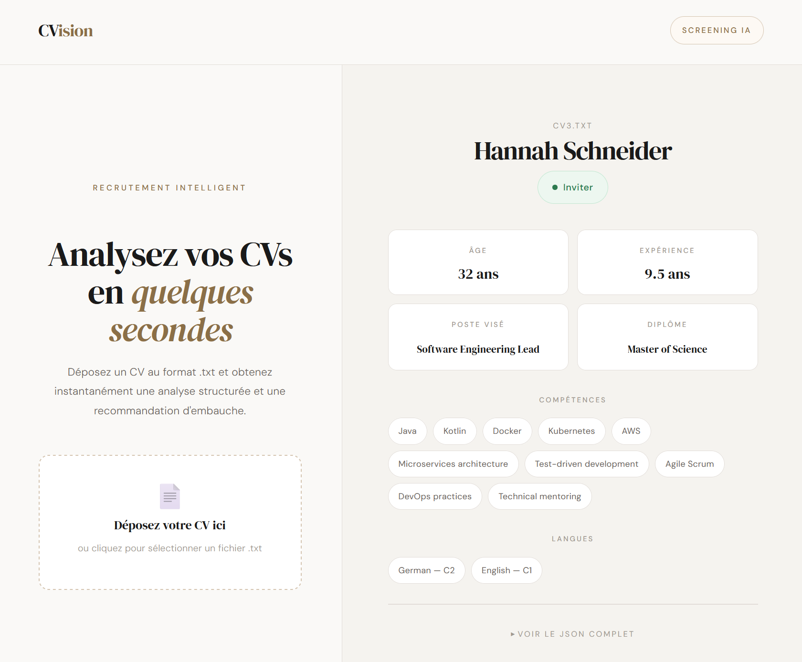

# CVision


Système automatisé de présélection de CVs basé sur l'IA.

Un CV est déposé via une interface web, analysé par un LLM, évalué par un modèle ML, et une décision **Inviter / Rejeter** est retournée en quelques secondes.

---

## Aperçu



---

## Architecture

```
Frontend (Vercel)
    ↓ POST .txt
n8n (webhook)
    ↓ POST /process-cv
FastAPI (DigitalOcean)
    ↓
loader.py → validation du fichier
    ↓
analyzer.py → extraction JSON via Groq
    ↓
Modèle ML → décision Inviter / Rejeter
    ↓
JSON retourné au frontend
```

---

## Structure du projet

```
CVision/
├── config/
│   ├── config.yaml          # clé API, modèle, température (gitignore)
│   ├── config_example.yaml  # exemple de config
│   ├── prompt.txt           # prompt LLM (gitignore)
│   └── prompt_example.txt   # exemple de prompt
├── core/
│   ├── loader.py            # validation et lecture des fichiers .txt
│   ├── analyzer.py          # extraction JSON via Groq
│   └── features.py          # feature engineering pour le ML
├── data/
│   ├── raw/                 # CVs bruts (.txt)
│   ├── processed/           # CVs extraits (.json)
│   └── labels.csv           # labels d'entraînement
├── models/
│   └── model.pkl            # modèle ML entraîné
├── frontend_example/        # interface React (exemple frontend)
├── api.py                   # API FastAPI
├── main.py                  # batch processing local
├── train.py                 # entraînement du modèle ML
├── Dockerfile
└── docker-compose.yml
```

---

## Installation

### Prérequis
- Python 3.12
- Docker
- Une clé API Groq

### Lancement local

```bash
git clone https://github.com/dlz-dev/CVision.git
cd CVision

python -m venv .venv
source .venv/bin/activate  # Windows : .venv\Scripts\activate

pip install -r requirements.txt

cp config/config_example.yaml config/config.yaml
cp config/prompt_example.txt config/prompt.txt

uvicorn api:app --reload
```

### Lancement avec Docker

```bash
docker compose up -d --build
```

---

## Utilisation

```bash
curl -X POST "http://localhost:8000/process-cv" -F "file=@cv.txt"
```

Réponse :

```json
{
  "name": "Olivia Martinez",
  "age": 35,
  "target_role": "Senior Data Analyst",
  "total_experience_years": 13.67,
  "skills": ["Python", "SQL", "Tableau"],
  "decision": "Inviter"
}
```

---

## Entraînement du modèle

```bash
python main.py   # traite les CVs bruts
python train.py  # entraîne le modèle
```

---

## Équipe

Projet réalisé dans le cadre du cours : Projet Global en Intelligence Artificielle — HELMo Bloc 2 Q2